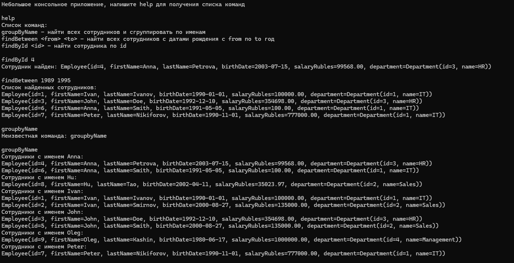

### Employee task test app

Для запуска (при работающем контейнере docker):

```shell
  java -jar ./jars/employee-task-0.0.1-SNAPSHOT.jar 
  ```
или
```shell
  ./gradlew bootRun
  ```

или запустить через IDE

<br>
Консольный интерфейс (после вывода INFO бинов Spring Boot'а)



###

by: Максим Петров, tg: @fish_from_sandiego
